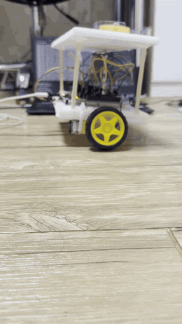
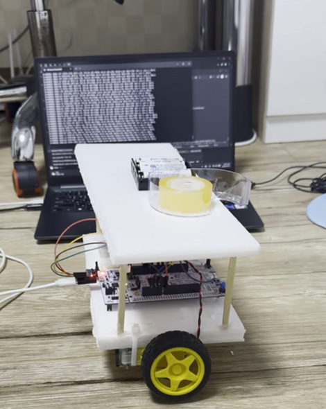

# BalanceBot F446ZE

STM32 **NUCLEO-F446ZE**로 만든 2륜 자가균형 로봇입니다.
MPU6050으로 기울기를 재고, 상보필터로 각도를 추정한 뒤, 각도 PID로 TB6612FNG 모터 드라이버를 구동합니다.

현재는 **엔코더 없이 각도 루프만으로** 약 1분간 스스로 균형을 유지합니다.

## 데모

<p align="center">
  <a href="docs/evidence.mp4"></a>
  &nbsp;&nbsp;
  
</p>

<p align="center">
  <a href="docs/evidence.mp4">▶ 영상 보기 (H.264, 720p)</a> ·
  <a href="evidence.mp4">원본 영상 (HEVC, 1080p)</a>
</p>

> 원본 영상은 HEVC(H.265)라 크롬·엣지 등 일부 브라우저에서 재생되지 않을 수 있습니다. 그럴 때는 H.264 사본을 여세요.

---

## 하드웨어

| 부품 | 모델 | 비고 |
|---|---|---|
| MCU 보드 | NUCLEO-F446ZE | USB(ST-LINK)로 전원·디버그·시리얼 |
| IMU | MPU6050 (GY-521) | 호환칩 `WHO_AM_I=0x72`, I2C 0x68 |
| 모터 드라이버 | TB6612FNG | |
| 모터 | DFRobot FIT0450 × 2 | 6V, 160 RPM, 120:1 감속, 엔코더 내장 (현재 미사용) |
| 모터 전원 | AA 알칼리 × 4 (6V) | 모터 전용 |

차체는 폼보드 2층 구조입니다. 나무젓가락 기둥으로 1층 위 약 10cm에 2층을 올렸고, 2층에 배터리와 추를 얹어 **무게중심을 바퀴 축보다 높게** 잡았습니다. 역진자는 길수록 천천히 넘어지기 때문에, 느린 모터로도 쫓아갈 여유가 생깁니다.

## 배선

### MPU6050

| MPU6050 | Nucleo |
|---|---|
| VCC | **3V3** (6V 금지) |
| GND | GND (모터 접지와 **별도 핀**) |
| SCL | D15 (PB8, I2C1) |
| SDA | D14 (PB9, I2C1) |
| INT, AD0, XCL, XDA | 연결 안 함 |

### TB6612FNG

| TB6612 | Nucleo | STM32 |
|---|---|---|
| STBY | A0 | PA3 |
| PWMA | D10 | PD14 (TIM4_CH3) |
| AIN1 | D2 | PF15 |
| AIN2 | D4 | PF14 |
| PWMB | D9 | PD15 (TIM4_CH4) |
| BIN1 | D7 | PF13 |
| BIN2 | D8 | PF12 |
| VCC | 3V3 | |
| VM | 배터리 + (6V) | |
| GND | 배터리 −, Nucleo GND | 아래 "접지" 참고 |

| 모터 출력 | 연결 |
|---|---|
| AO1 / AO2 | 왼쪽 모터 빨강 / 검정 |
| BO1 / BO2 | 오른쪽 모터 빨강 / 검정 |

모터의 빨강·검정 선은 꼬인 채로 두세요. 풀면 PWM 노이즈가 커집니다. 좌우 모터가 서로 마주 보게 달렸으므로 회전 방향은 펌웨어(`LSIGN`/`RSIGN`)에서 맞춥니다.

### 접지 (중요)

모터 전류가 흐르는 경로와 센서가 기준으로 삼는 경로를 **공유하지 않게** 해야 합니다.

```
[고전류 루프]  배터리 +  ──→ TB6612 VM
               배터리 −  ──→ TB6612 GND        (짧고 굵게, 꼬아서, 브레드보드 경유 금지)

[기준 연결]    TB6612 GND ──→ Nucleo GND 핀 ①  (전류 거의 없음)

[센서 전용]    MPU GND    ──→ Nucleo GND 핀 ②  (①과 다른 핀)
               MPU VCC    ──→ Nucleo 3V3
```

처음에는 배터리 −, TB6612 GND, MPU GND가 브레드보드 GND 레일 하나를 같이 썼습니다. 그러자 모터가 세게 돌 때마다 레일 접점 저항에 수백 mV가 걸려 MPU의 기준 전위가 흔들렸고, I2C가 끊기거나 MPU가 래치업되어 전원을 뽑아야만 살아났습니다. 위처럼 스타 접지로 바꾼 뒤 이 문제가 사라졌습니다.

---

## 동작 원리

```
MPU6050 ──I2C──▶ 상보필터 ──▶ 각도 ──▶ PID ──▶ 데드존 보정 ──▶ TB6612 ──▶ 모터
 (250 Hz)        α = 0.98                                   (TIM4, 20 kHz PWM)
```

- **제어 주기**: 4 ms (250 Hz). MPU 샘플레이트도 250 Hz로 맞췄습니다.
- **각도 추정**: 가속도계 각도와 자이로 적분을 α = 0.98로 섞습니다 (시정수 약 0.2초).
- **D항**: 오차를 미분하지 않고 자이로 각속도를 그대로 씁니다. 미분 노이즈와 목표값 변경 시의 킥이 없습니다.
- **데드존 보정**: 명령 `0‥799`를 듀티 `DEAD‥799`로 **선형 재매핑**합니다. 정지 마찰 구간은 건너뛰면서도 작은 오차에는 작은 출력이 나가게 해서, 균형점 근처의 제자리 떨림을 줄입니다.
- **넘어짐 판정**: 35° 넘게 기울면 모터를 끕니다. 다시 세우면 자동으로 복귀합니다.

### 자동 ARM

부팅 후 차체를 **균형 자세(목표각 ±8°)로, 흔들림 없이(자이로 30 dps 이하) 1초** 들고 있으면 스스로 제어를 시작합니다. 들고 옮기는 중에는 자이로가 흔들려 켜지지 않습니다.

`STOP` 명령이나 **B1 버튼**으로 멈추면 자동 ARM이 꺼집니다 (멈춤 버튼이 확실히 멈추도록). 다시 켜려면 `ARM`을 보내거나 B1을 한 번 더 누르세요. 넘어져서 멈춘 경우에는 꺼지지 않으므로, 세우기만 하면 다시 시작합니다.

### I2C 버스 복구

모터 노이즈로 전송이 끊기면 MPU가 SDA를 LOW로 붙잡은 채 멈출 수 있습니다. 이 상태는 MCU를 리셋해도 풀리지 않습니다. 펌웨어는 연속 3회 읽기에 실패하면 다음 순서로 스스로 복구합니다.

1. I2C1 해제
2. SCL에 클럭 펄스 9개를 직접 넣어 붙잡힌 슬레이브를 풀어줌
3. I2C1 재초기화, MPU 레지스터 재설정 (자이로 보정과 기준각은 다시 잡지 않음 — 로봇이 움직이는 중이므로)

복구에 성공하면 `I2C: bus recovered`를 출력하고 계속 균형을 잡습니다. 정상 구간 없이 복구가 5회를 넘으면 포기하고 `MPU_FAULT`로 멈춥니다.

---

## 사용법

### 빌드와 업로드

1. STM32CubeIDE → `File > Import > Existing Projects into Workspace`
2. `STM32CubeIDE` 폴더 선택
3. 빌드(`Ctrl+B`) 후 Run

`Drivers/`(HAL, CMSIS)가 포함되어 있어 CubeMX 코드 생성 없이 바로 빌드됩니다.

### 실행

1. 시리얼 터미널을 ST-LINK 가상 COM 포트에 **115200-8N1**로 엽니다.
2. 차체를 **균형 자세로 잡은 채** RESET을 누르고 2초간 가만히 둡니다. 이때의 자세가 0° 기준이 되고, 자이로 오프셋도 이때 잡힙니다.
3. `READY` 메시지가 나오면 그대로 1초 들고 있다가 손을 뗍니다.

처음 조립했거나 부품을 옮겼다면, 바퀴를 바닥에서 띄운 채로 방향부터 확인하세요 (아래 "브링업").

### LED

| LED | 상태 |
|---|---|
| 파랑 (LD2) | READY — 대기, 모터 정지 |
| 초록 (LD1) | ARMED — 균형 제어 중 |
| 빨강 (LD3) | FALLEN 또는 MPU_FAULT |

### 시리얼 명령

값은 즉시 적용되며, 균형을 잡는 중에도 바꿀 수 있습니다. 대소문자는 구분하지 않습니다. **리셋하면 아래 기본값으로 돌아갑니다.**

| 명령 | 설명 | 범위 |
|---|---|---|
| `ARM` / `STOP` | 제어 시작 / 정지 (`DISARM`도 가능) | |
| `STATUS` / `HELP` | 현재 상태 / 명령 목록 | |
| `KP n` `KI n` `KD n` | PID 게인 | KP·KI 0‥100, KD 0‥20 |
| `TARGET n` | 균형점 각도 (°) | −10‥10 |
| `DEAD n` | 모터 데드존 (PWM 카운트) | 0‥300 |
| `MAXPWM n` | 출력 상한 | 100‥799 |
| `SSIGN n` | 센서 각도 부호 | ±1 |
| `LSIGN n` `RSIGN n` | 왼쪽 / 오른쪽 모터 방향 | ±1 |
| `TEST L n` `TEST R n` `TEST BOTH n` | 모터 0.4초 시험 구동 (ARMED가 아닐 때만) | −250‥250 |

텔레메트리는 200 ms마다 한 줄씩 나옵니다. `ANG`, `GYR`, `TGT`는 0.01 단위이고 게인은 100배로 표시됩니다.

```
S=ARMED ANG=-37 GYR=552 OUT=15 TGT=-50 KP=4500 KI=0 KD=250 DEAD=130 MAX=799 SS=-1 LS=-1 RS=1
         -0.37°  5.52dps           -0.50°  45.00      2.50
```

### 현재 기본값

| 값 | 설정 | 근거 |
|---|---|---|
| `KP` | 45 | 28에서는 넘어지는 속도를 못 따라감 |
| `KI` | 0 | P·D가 먼저 안정된 뒤에 사용 |
| `KD` | 2.5 | 느린 좌우 흔들림의 오버슈트 감쇠 |
| `TARGET` | −0.5° | 균형 중 `OUT` 평균이 0이 되는 지점 |
| `DEAD` | 130 | FIT0450 기동 최소 듀티 실측 |
| `MAXPWM` | 799 | 모터가 느려 전 구간 필요 |
| `SSIGN` / `LSIGN` / `RSIGN` | −1 / −1 / +1 | 이 차체의 장착 방향 기준 실측 |

`balance_bot.c` 상단에 있으며, 값마다 이유가 주석으로 달려 있습니다.

> `INTEGRAL_LIMIT`이 10 (°·s)이라 KI의 최대 기여는 `KI × 10` 카운트입니다. 이 펌웨어에서 KI가 효과를 내려면 **5‥30** 정도가 필요합니다.

---

## 브링업

부품을 새로 조립했거나 옮겼을 때 이 순서로 확인합니다. **바퀴는 바닥에서 띄운 채로** 하세요.

1. **모터 방향** — `STOP` 후 `TEST BOTH 250`. 두 바퀴가 차체를 **같은 방향(앞 = MPU가 붙은 쪽)** 으로 밀어야 합니다. 아니면 `LSIGN` / `RSIGN`.
2. **데드존** — `DEAD 0` 후 `TEST BOTH 60`, `80`, `100`… 올려가며 두 바퀴가 모두 도는 최소값을 찾고, 약간 여유를 둬서 `DEAD n`.
3. **각도 부호** — 앞으로 기울였을 때 `ANG`이 양수여야 합니다. 아니면 `SSIGN -1`.
4. **제어 방향** — `ARM` 후 앞으로 기울이면 바퀴가 **앞으로** 따라가야 합니다.
5. **균형점** — 바닥에 두고 `OUT` 평균이 0 근처가 되도록 `TARGET`을 0.1‥0.3씩 조정.
6. **게인** — 힘없이 넘어지면 `KP`↑, 빠르게 떨며 커지면 `KD`↑, 잔떨림만 있으면 `KP`↓.

## 문제 해결

| 증상 | 원인 | 해결 |
|---|---|---|
| 부팅 시 `FAULT: no compatible MPU response` | MPU 배선 또는 버스가 잡혀 있음 | 출력되는 `BUS RELEASED` 줄로 판별. SDA=0이면 USB와 배터리를 모두 뽑고 5초 뒤 재연결 |
| 모터가 셀 때만 `I2C: bus recovered` 반복 | 모터 전류가 센서 접지를 흔듦 | 위의 스타 접지 |
| 명령은 먹는데 모터가 안 돔 | VM 전원, 배터리 −, STBY 중 하나 | 셋 다 확인. 한쪽만 안 돌면 모터를 좌우 맞바꿔 원인이 모터인지 채널인지 가르기 |
| 한쪽 모터만 안 돔 | 점퍼가 한 칸 밀림, 모터 리드 납땜 끊김 | 헤더 실크스크린 재확인. TT형 모터는 몸체 납땜부가 잘 끊어짐 |
| 한 방향으로 계속 밀리다 넘어짐 | 무게중심이 축 앞/뒤에 있음 | 로봇을 바퀴 축으로 들어 어느 쪽으로 쏠리는지 보고 무게 이동 |
| 오래 못 버팀 | 무게중심이 낮음 | 무거운 것을 더 높이 |

이 프로젝트에서 겪은 문제는 거의 전부 **배선과 접지**였습니다. 코드를 의심하기 전에 선부터 보세요.

---

## 한계와 다음 단계

**각도만 보는 제어는 원리적으로 오래 버틸 수 없습니다.** 모터에 주는 듀티는 사실상 바퀴 속도를 정하는데, 기울기를 바로잡을 때마다 한쪽으로 속도가 조금씩 쌓입니다. 결국 모터가 최고 속도(160 RPM)에 닿으면 더 가속할 수 없어 넘어집니다.

다음 단계는 FIT0450에 이미 달려 있는 **엔코더로 속도 루프를 추가**하는 것입니다. 바퀴가 한쪽으로 빨라지면 목표각을 반대로 살짝 기울여 속도를 0 근처로 되돌리고, 항상 양방향으로 가속할 여유를 남겨 둡니다. 위치 루프는 넣지 않을 계획입니다 — 제자리 고정보다 넘어지지 않는 것이 목표입니다.

| 엔코더 | 타이머 | A상 | B상 |
|---|---|---|---|
| 왼쪽 | TIM3 | PA6 (D12) | PA7 (D11) |
| 오른쪽 | TIM2 | PA0 | PA1 |

엔코더 VCC는 3V3, GND는 모터 접지가 아닌 Nucleo GND 핀에 직접 연결합니다.

그 밖에 해볼 것:

- 모터 단자에 0.1 µF, TB6612 VM에 1000 µF 커패시터 (노이즈·전압 강하 대책)
- 알칼리 대신 NiMH 전지 (전지가 닳을수록 게인이 안 맞게 되는 문제 완화)
- HC-06 블루투스로 무선 튜닝 (USB 케이블이 로봇을 잡아당기지 않도록)

## 폴더 구조

```
BalanceBot_F446ZE/
├── BalanceBot_F446ZE.ioc          CubeMX 설정
├── Inc/, Src/                     CubeMX 생성 코드 (main.c, 주변장치 초기화)
├── Drivers/                       STM32F4 HAL, CMSIS
├── STM32CubeIDE/
│   ├── .project, .cproject        IDE 프로젝트 (이 폴더를 Import)
│   └── Application/User/
│       └── balance_bot.c          ← 제어 로직 전부
├── docs/                          데모 GIF, H.264 영상
├── image.png, evidence.mp4        사진, 원본 영상
└── README_KO.md                   초기(2026년 7월) 설계 문서
```
